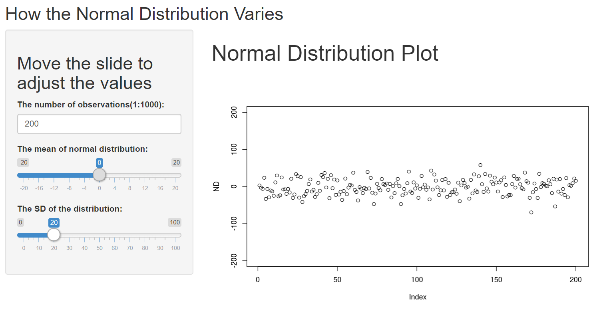

```{r setup, include=FALSE}
knitr::opts_chunk$set(echo = FALSE)
```

## Description of the Application

This application can be used to generate a plot of random normal distribution with varying variables. It can show the random normal distribution in a more interactive way.

## The code of ui.R
```{R, eval=FALSE, echo=TRUE}
library(shiny)
shinyUI(fluidPage(
  titlePanel("How the Normal Distribution Varies"),
  sidebarLayout(
    sidebarPanel(
      h2("Move the slide to adjust the values"),
      numericInput("n","The number of observations(1:1000):",
                  min = 100,max=1000, value=200),
       sliderInput("mu","The mean of normal distribution:",
                   min = -20,max = 20,value = 0),
      sliderInput("lambda","The SD of the distribution:",
                  min = 0,max = 100,value = 10)
    ),
    
    mainPanel(
      h1("Normal Distribution Plot"),
       plotOutput("NDPlot")
    )
  )
))
```

## The code of server.R
```{R, eval=FALSE,echo=TRUE}
library(shiny)

shinyServer(function(input, output) {
   
  output$NDPlot <- renderPlot({
    number<-input$n
    x<-  input$mu
    y <- input$lambda
    
    ND<-rnorm(n=number,mean = x,sd=y)
    plot(ND,ylim = c(-200,200))
  })
})
```

## The Link to the application
The image shows us the interface of this application.


[The link to application](https://stevenwz.shinyapps.io/DDP-FinalProject/)